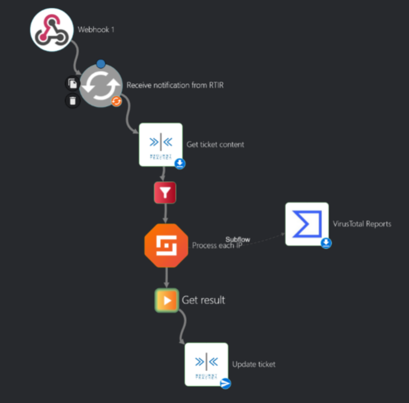

# Automation Tools training material
Sample code snippets used during automation tools training

## RTIR Scrip: Adjust Priority on Importance or Severity Change
1. Custom Condition:
```perl
# Do calculation if: new ticket created or CF values are changed
return 1 if $self->TransactionObj->Type eq "Create";
return 0 unless $self->TransactionObj->Type eq 'CustomField';
my $cf = RT::CustomField->new( $self->CurrentUser );
$cf->Load( $self->TransactionObj->Field );
return 0 unless $cf->Name eq 'Importance' || $cf->Name eq 'Severity';
return 1;
```
2. Custom action commit code
```perl
my $severities = {
	'High risky' => 0,'Normal' => 1,'Low' => 2,
};
my $importances = {
	'Very important' => 0,'Normal' => 1,'Low' => 2,
};
my $priorities=[
	[100, 100, 50],
	[50, 50, 10],
	[10, 10, 10],
];
my $severity = $self->TicketObj->CustomFieldValues('Severity')->Next->Content;
my $importance = $self->TicketObj->CustomFieldValues('Importance')->Next->Content;

return 0 unless defined ${$severities}{$severity};
return 0 unless defined ${$importances}{$importance};

my $priority=$priorities->[${$severities}{$severity}][${$importances}{$importance}];
$self->TicketObj->SetPriority ($priority);

$RT::Logger->debug("Importance: " .$importance. 
                  ",Severity: " . $severity. 
                  ",Priority: " . $priority);

return 1;
```

## Automated triage implementation

### RTIR scrip for sending Incident Report to SOAR webhook
1. Custom Condition: ``On Create``

1. Custom action commit code
```perl
use LWP::UserAgent;
use JSON;
my $webhook_url = "https://shuffle.local/api/v1/hooks/webhook_unique_address";   
my $ticket   = $self->TicketObj;
my $txn      = $self->TransactionObj;
my @requestors;
my $members = $ticket->Requestors->UserMembersObj;
while (my $user = $members->Next) {  push @requestors, $user->EmailAddress; }
my %data = (
    id          => $ticket->Id,
    subject     => $ticket->Subject,
    status      => $ticket->Status,
    queue       => $ticket->QueueObj->Name,
    requestors  => \@requestors,
    created     => $ticket->Created
);
my $ua  = LWP::UserAgent->new(ssl_opts => {verify_hostname => 0,SSL_verify_mode => 0x00,});
my $res = $ua->post(  $webhook_url, 'Content-Type' => 'application/json', Content => encode_json(\%data));
if (!$res->is_success) {
    $RT::Logger->error("Webhook POST failed: " . $res->status_line);
}

```
### Shuffle Workflow implementation


#### Shuffle SOAR action "Get result"
Action is used to create HTML from VirusTotal report 

```python
true=True
false=False
data=$process_each_ip

import html
import json
from datetime import datetime

def _ts(dt):
    try:
        return datetime.utcfromtimestamp(int(dt)).strftime("%Y-%m-%d %H:%M:%S UTC")
    except Exception:
        return "—"
def add_line(param="", value=""):
    text = ""
    strvalue=str(value)
    if len(strvalue)>0:
        text += "<li><span style=\"font-size:small;font-weight:bold\">{}</span>: {}</li>".format(param,value)
    else:
        text += "<li><span style=\"font-size:small;font-weight:bold\">{}</span></li>".format(param)
    return text

def summarize_stats(stats):
    harmless = int(stats.get("harmless", 0))
    malicious = int(stats.get("malicious", 0))
    suspicious = int(stats.get("suspicious", 0))
    undetected = int(stats.get("undetected", 0))
    timeout = int(stats.get("timeout", 0))
    if malicious > 0:
        verdict = "<span style=\"color:red\">Malicious</span>"
    elif suspicious > 0:
        verdict = "<span style=\"color:orange\">Suspicious</span>"
    elif harmless > 0:
        verdict = "<span style=\"color:darkgreen\">No engines flagged (harmless)</span>"
    else:
        verdict = "<span style=\"color:blue\">Inconclusive</span>"
    return harmless, malicious, suspicious, undetected, timeout, verdict

def vt_ip_to_card(ip_report):
    ip=ip_report.get("id","(unknown)")
    last_analysis=ip_report.get("attributes",{}).get("last_analysis_stats",{})
    last_analysis_html=""
    harmless, malicious, suspicious, undetected, timeout, verdict = summarize_stats(last_analysis)
    reputation = ip_report.get("attributes",{}).get("reputation",0)
    votes_mal = ip_report.get("attributes",{}).get("total_votes",{}).get("malicious",0)
    votes_har = ip_report.get("attributes",{}).get("total_votes",{}).get("harmless",0)
    last_mod = _ts(ip_report.get("attributes",{}).get("last_modification_date","(unknown)"))
    tags = ip_report.get("attributes",{}).get("tags",[]) 
    country = ip_report.get("attributes",{}).get("country","(unknown)")
    asn = ip_report.get("attributes",{}).get("asn","(unknown)")
    as_owner = ip_report.get("attributes",{}).get("as_owner","(unknown)")
    network = ip_report.get("attributes",{}).get("network","(unknown)")
    tag_str = ", ".join(sorted(set(map(str, tags)))) if isinstance(tags, (list, set, tuple)) else "—"
    return f"""
    <table>
      <tr><td colspan=2><span style=\"font-size:larger;font-weight:bold;color: #808080;\">{html.escape(str(ip))}</span></td></tr>
      <tr>
        <td>
          <h6>Summary</h6>
          <ul>
            {add_line("Verdict",verdict)}
            {add_line("Reputation",html.escape(str(reputation)))}
            {add_line("Engine stats",html.escape("malicious={}, suspicious={}, harmless={}, undetected={}, timeout={}".format(malicious,suspicious,harmless,undetected,timeout)))}
            {add_line("Total votes",html.escape("malicious={}, harmless={}".format(votes_mal,votes_har)))}
            {add_line("Last updated",html.escape(last_mod))}
          </ul>
        </td>
        <td>
          <h6>Network</h6>
          <ul>
            {add_line("Country",html.escape(str(country)))}
            {add_line("ASN",html.escape(str(asn)))}
            {add_line("Owner",html.escape(str(as_owner)))}
            {add_line("Network",html.escape(str(network)))}
            {add_line("Tags",html.escape(str(tag_str)))}
          </ul>
        </td>
      </tr>
    </table>
    """

def generate_html_from_vt(reports):
    if isinstance(reports, (list, tuple)):
        items = reports
    else:
        items = [reports]

    cards = []
    for rep in items:
      results= rep.get("result", {})
      if isinstance(results, str):
          try:
              results = json.loads(results)
          except Exception:
              results = {}
      
      try:
          cards.append(vt_ip_to_card(results.get("body", {}).get("data", {})))
      except Exception as e:
            cards.append(f"""
            <section class="card">
              <h4 class="ip">(unable to parse)</h4>
              <pre class="error">{html.escape(str(e))}</pre>
            </section>
            """)

    html_doc = f"""<h3>VirusTotal — IP Address Summary</h3>{''.join(cards)}"""
    return html_doc

html_out = generate_html_from_vt(data)
output={ "Content": html_out, "ContentType": "text/html" }
print (json.dumps(output))

```
